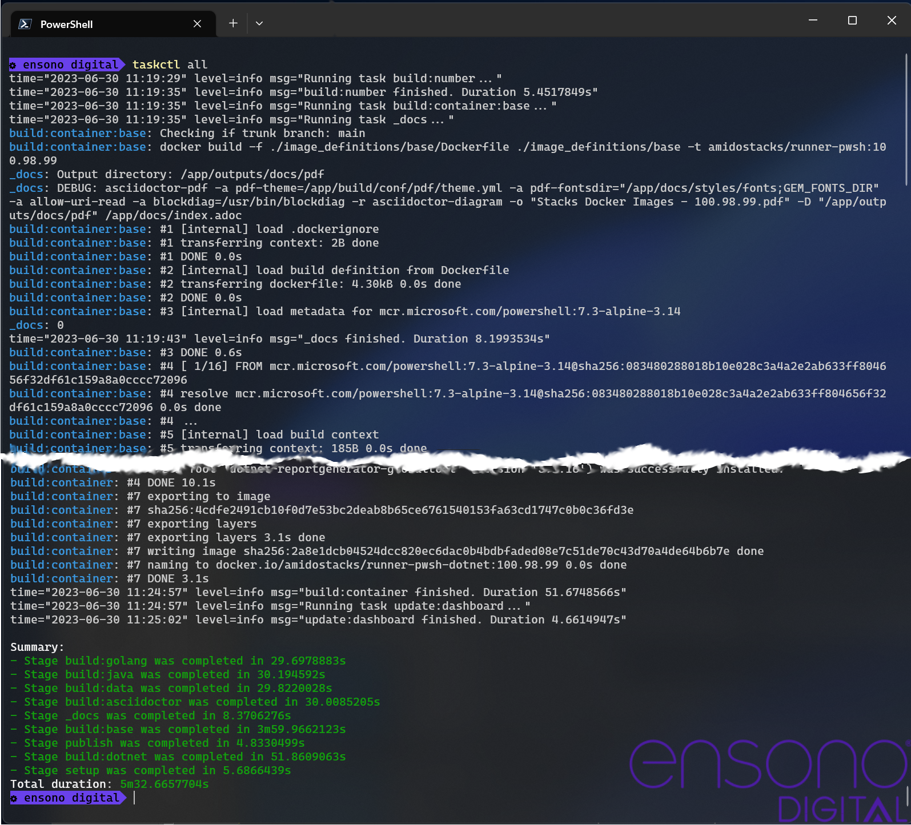

:project_name: Ensono Stacks
:cr_repo_name: amidostacks

:icons: font
:source-highlighter: rouge

= {project_name} Docker Images

As part of the {project_name} ecosystem there is the Independent Runner which allows pipelines to be run locally as well as in any CI/CD system. The way it accomplishes this is to isolate everything in Docker containers. This repository holds all of the `Dockerfiles` that are used to build each of the different images that are required.

The ai of the images is to have tools that are required for a specific job, e.g. building a .NET application, but not have all of the tools in one giant image. The following table shows the images that are built from this repository.

.Summary of Docker images
[cols="1,1,1,3,1",options="header",stripes=even]
|===
| Name | Tag | Base Image | Description | Reference
| base | `{cr_repo_name}/runner-pwsh` | `mcr.microsoft.com/powershell:7.3-alpine-3.14` | Base image for building the other images. It contains applications
and tools that are required by each build. | <<Base Image>>
| java | `{cr_repo_name}/runner-pwsh-java` | `{cr_repo_name}/runner-pwsh` | Image to build Java applications with. Uses Azul Java. | <<Java Image>>
| dotnet | `{cr_repo_name}/runner-pwsh-dotnet` | `{cr_repo_name}/runner-pwsh-java` | Image with .NET installed.

It is based on Java because of the Sonarqube requirement | <<Dotnet Image>>
| golang | `{cr_repo_name}/runner-pwsh-golang` | `{cr_repo_name}/runner-pwsh`
`golang:1.192.2-alpine3.16` | Used to build our Go based applications, such as https://github.com/Ensono/stacls-cli[Stacks CLI] | <<Golang Image>>
| inspec | `{cr_repo_name}/runner-pwsh-inspec` | `{cr_repo_name}/runner-pwsh` | Image used when running infrastructure tests against deployments | <<Inspec Image>>
| data | `{cr_repo_name}/runner-pwsh-data` | `{cr_repo_name}/runner-pwsh` | Used for Data Engineering projects, contains specific tools for such projects | <<Data Image>>
| ascidoctor | `{cr_repo_name}/runner-pwsh-asciidoctor` | `{cr_repo_name}/runner-pwsh-java` | Image used for building documentation that has been written in the `adoc` format | <<Asciidoctor Image>>
|===

The following diagram shows the dependencies of the images.

.Docker image dependencies
[blockdiag]
....
blockdiag {
    powershell [label = "mcr.microsoft.com/powershell:7.3-alpine-3.14", style = dotted, width = 175, shape = "roundedbox" ]
    golang_base [label = "golang:1.19.2-alpine3.16", style = dotted, shape = "roundedbox", width = 175]
    ubuntu [label = "ubuntu:20.04", style = dotted, shape = "roundedbox", width = 175]

    powershell -> base -> java -> dotnet
    base -> java -> asciidoctor

    base -> ubuntu -> inspec

    base -> data
    base -> golang_base -> golang
}
....

The rounded box show the images that are pulled in from vendors to assist with the build of the container images here.

<<<

== Building Images

The Independent Runner is used to create the images for the Independent Runner, but to avoid a circular dependency the base image is built without using a container.

This is the case if running in ADO or on a local machine. The only dependency that needs to be installed beforehand is the EnsonoBuild PowerShell module and it needs to be added to your `PSModulePath` environment variable.

NOTE: In the ADO pipeline the initial steps install the module to setup the environment.

All subsequent images then use the base image as required, and will indeed build within that container. To ensure that the correct image is used, the IMAGE_TAG for the current build is passed to each image as as a Docker build argument.

The following command will run the pipeline to build all the images.

[source,powershell]
----
taskctl all
----

.Building the images

NOTE: The Independent Runner will automatically tag builds with the `latest` but only when running on the trunk branch.

<<<

== Docker Image Definitions

Each of the following sections details what is in each of the Docker images.

:name: Base
include::base_image.adoc[]

:name: Java
include::java_image.adoc[]

:name: DotNet
include::dotnet_image.adoc[]

:name: Golang
include::golang_image.adoc[]

:name: Inspec
include::inspec_image.adoc[]

:name: Data
include::data_image.adoc[]

:name: AsciiDoctor
include::asciidoctor_image.adoc[]
