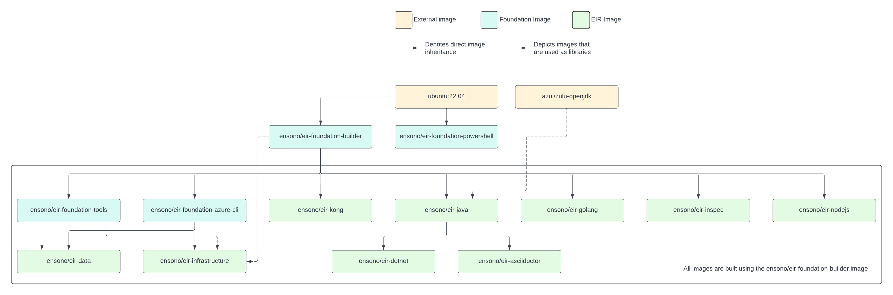

As part of the {project_name} ecosystem there is the Independent Runner which allows pipelines to be run locally as well as in any CI/CD system. The way it accomplishes this is to isolate everything in Docker containers. This repository holds all of the `Dockerfiles` that are used to build each of the different images that are required.

In an update to the way in which the images are built, they are now based on Ubuntu 22.04 and we build for multiple platforms:

* linux/amd64
* linux/arm64

The aim of the images is to have tools that are required for a specific job, e.g. building a .NET application, but not have all of the tools in one giant image. The following table shows the images that are built from this repository.

.Summary of Docker images
[cols="1,1,1,3,1",options="header",stripes=even]
|===
| Name | Tag | Base Image | Description | Reference
| Foundation PowerShell | `{cr_repo_name}/eir-foundation-powershell` | `ubuntu:22.04` | Base image that contains PowerShell | base 
| Foundation Tools | `{cr_repo_name}/eir-foundation-tools` | `{cr_repo_name}/eir-foundation-powershell` | Base image for building the other images. It contains applications
and tools that are required by each build. | <<EIR Foundation PowerShell>>
| Foundation Azure CLI | `{cr_repo_name}/eir-foundation-azure-cli` | `{cr_repo_name}/eir-foundation-powershell` | Image containing the Azure CLI, this can be used as a base image so that extensions can be added as required | <<EIR Foundation Azure CLI>>
| Java | `{cr_repo_name}/eir-java` | `{cr_repo_name}/eir-foundation-powershell` | Image to build Java applications with. Uses Azul Java. | <<EIR Java>>
| Dotnet | `{cr_repo_name}/eir-dotnet` | `{cr_repo_name}/eir-java` | Image with .NET installed.

It is based on Java because of the Sonarqube requirement | <<EIR Dotnet>>
| Go | `{cr_repo_name}/eir-golang` | `{cr_repo_name}/eir-foundation-powershell` | Used to build our Go based applications, such as https://github.com/amido/stacls-cli[Stacks CLI] | <<EIR Golang>>
| Inspec | `{cr_repo_name}/eir-inspec` | `{cr_repo_name}/eir-foundation-powershell` | Image used when running infrastructure tests against deployments | <<EIR Inspec>>
| Data | `{cr_repo_name}/eir-data` | `{cr_repo_name}/eir-foundation-azure-cli` | Used for Data Engineering projects, contains specific tools for such projects | <<EIR Data>>
| Asciidoctor | `{cr_repo_name}/eir-asciidoctor` | `{cr_repo_name}/eir-foundation-powershell` | Image used for building documentation that has been written in the `adoc` format | <<EIR Asciidoctor>>
| Kong | `{cr_repo_name}/eir-kong` | `{cr_repo_name}/eir-foundation-powershell` | A command line tool for dumping API Products and documentation from Kong Konnect and syncing them back. | <<EIR Kong>>
|===

The following diagram shows the dependencies of the images.

[#docker-image-dependencies]
.Docker image dependencies
