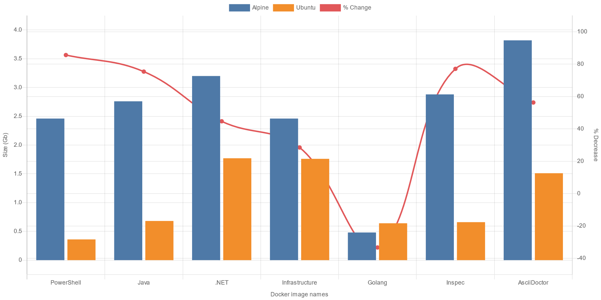

== Migration

We have chosen to migrate away from using Alpine based Docker images and to using Ubuntu. The reason for this is that we need to be able to support multi-platform images:

* Intel based machines (AMD64)
* Apple Silicon machines (ARM64)

Although there are ARM versions of Alpine and PowerShell, Microsoft have not released PowerShell for Alpine ARM64. This has meant that it is not possible to run the EIR Docker images on an Apple Silicon based Mac. We have now moved away from Alpine and use Ubuntu which can be easily built for the two targeted platforms.

The decision has been made to split the images up a bit, to more correctly reflect the scenarios in which they will be used. The following table shows the mapping from the old AmidoStacks images to these new ones.

[cols="3,3,1a",options=header,stripes=even]
|====
| AmidoStacks Image | EnsonoStacks Image | Python
| amidostacks/runner-pwsh | ensono/eir-foundation-powershell | icon:fas-times[]
| amidostacks/runner-pwsh-dotnet | ensono/eir-dotnet | icon:fas-times[]
| amidostacks/runner-pwsh-java | ensono/eir-java | icon:fas-times[]
| amidostacks/runner-pwsh-python | _No direct mapping_ | 
| amidostacks/runner-pwsh-data | ensono/eir-data | icon:fas-check[]
| amidostacks/runner-pwsh-golang | ensono/eir-golang | icon:fas-times[]
| amidostacks/runner-pwsh-pester | ensono/eir-infrastructure | icon:fas-check[]
| amidostacks/runner-pwsh-inspec | ensono/eir-inspec | icon:fas-times[]
|====

NOTE: The Python column denotes if Python is installed in the new images

Previously images were tagged with the build number and either `stable` or `unstable`, depending on which branch the build came from and pushed to Docker Hub, for example:

[cols="2,1,1,1,1",options=header,striped=even]
.Previous tagging strategy
|====
| Image Name | Version | Trunk Branch | Non-Trunk Branch | Platforms
| amidostacks/runner-pwsh | 1.2.3 | 1.2.3-stable | 1.2.3-unstable | `linux/amd64`
|====

The new images use two container registries, one for non-trunk branch builds and one for trunk builds.

.New tagging strategy
[cols="2,1,2,2,1",options=header,striped=even]
|====
| Image Name | Version | Trunk Branch | Non-Trunk Branch | Platforms
| ensono/eir-foundation-powershell | 1.2.3 | docker.io/ensono/eir-foundation-powershell:1.2.3 | ensonostackseuweirdfmu.azurecr.io/ensono/eir-foundation-powershell:1.2.3 | `linux/amd64`
`linux/arm64`
|====

=== Image Sizes

The following chart shows the sizes of the images before and after the migration from Alpine to Ubuntu.

.Docker Image Sizes

NOTE: As the scales of the two Y axes are on different scales, care must be taken when looking at the % decrease in size. For example the Golang image has increased and is a negative value.

There are a number of reasons as to why the new Ubuntu images are smaller that the previous Alpine images

1. The number of `RUN` statements in the Docker file has reduced leading to less layers
2. Tools and other applications have been split out to more images
3. Installation of tools has been confined to a tools library and then copied to necessary images, meaning that dev tools are not installed.
4. Tools used to install a package and are not required for use are removed
